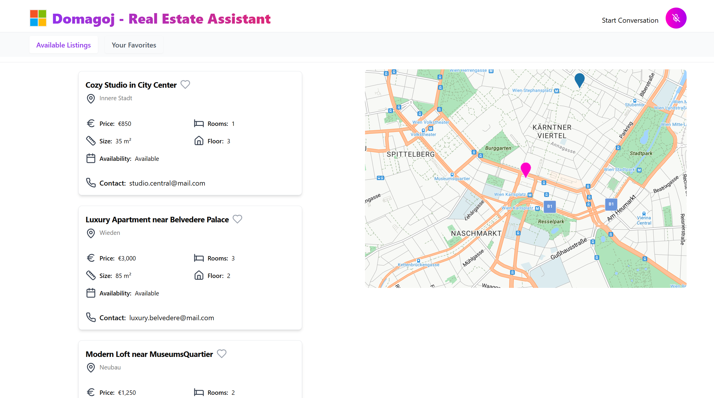

# domago

An interactive way to search flats in Vienna using Microsoft AI services.

## Screenshot



## Pre-requisites

Clicking on button bellow will redirect you to the Azure portal to deploy the resources necessary to conduct this demo using the ARM template provided in this repository.

[](https://portal.azure.com/#create/Microsoft.Template/uri/https%3A%2F%2Fraw.githubusercontent.com%2Fmoalsayed95%2Fdomago%2Fms%2Finfra%2Fazuredeploy.json)

This script will create the following resources: Azure AI Search, Azure Cosmos DB, Storage Account, Azure Maps Account, Azure OpenAI Service (with the deployments of `gpt-4o-realtime-preview` and `text-embedding-3-large`)

## Setup
1. Clone the repository.

```bash	
git clone https://github.com/moalsayed95/domago.git
```

## Development Environment

GitHub Codespaces is a cloud-based development environment that allows you to code from anywhere. It provides a fully configured environment that can be launched directly from any GitHub repository, saving you from lengthy setup times. You can access Codespaces from your browser, Visual Studio Code, or the GitHub CLI, making it easy to work from virtually any device.

[](https://codespaces.new/)

Please select your forked repository from the dropdown and choose `default_environment (Python 3.11)` as your default codespace configuration


3. After deploying the resources, you will need to configure the environment variables in the .env file. The .env file is a configuration file that contains the environment variables for the application. The .env file is automatically created running the following command within the terminal in your Codespace:

```bash
./get-keys.sh --resource-group <resource-group-name>
```


4. Create the AI search Index and index the dummy data from the `data` folder. The data folder has the flats data in JSON format `data/flat_cata.json`. You can do this by running the `index_manager.py` script in the backend project.

Example Data:  
```json
{
    "id": "1",
    "title": "Cozy Studio in City Center",
    "description": "A cozy studio apartment located in the heart of Vienna, just steps from Stephansplatz. Ideal for professionals or students seeking a central location.",
    "location": "Innere Stadt",
    "lat": 48.2082,
    "lng": 16.3738,
    "contact": "studio.central@mail.com",
    "price": 850,
    "rooms": 1,
    "size": 35,
    "floor": 3,
    "availability": "Available",
    "furnished": true,
    "pets_allowed": false,
    "smoking_allowed": false,
    "elevator": true,
    "balcony": false,
    "deposit": 2000
  }
```	


5. Run the backend server.

```bash
cd app/backend && python app.py
```

6. Open another terminal and run the frontend server.

```bash
cd app/frontend && npm run dev
```

both the frontend and backend servers should be running for the app to work.

## Interactive voice commands:
- `I am looking for a flat in the city center show me some options`
- `I like this flat (say the flat's title and ask for more details)`
- `I like this flat (say the flat's title) could you add it to my favorites`
- `I like this flat (say the flat's title) could you zoom in on the map`
